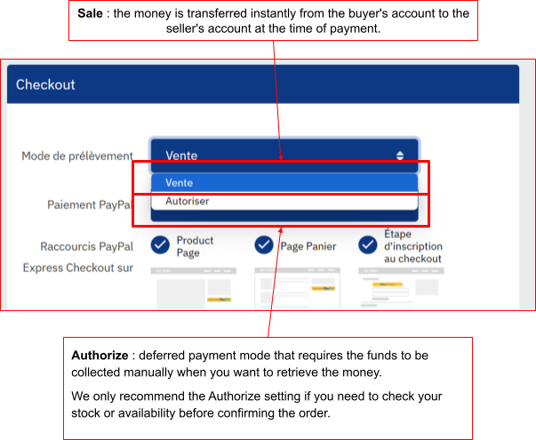
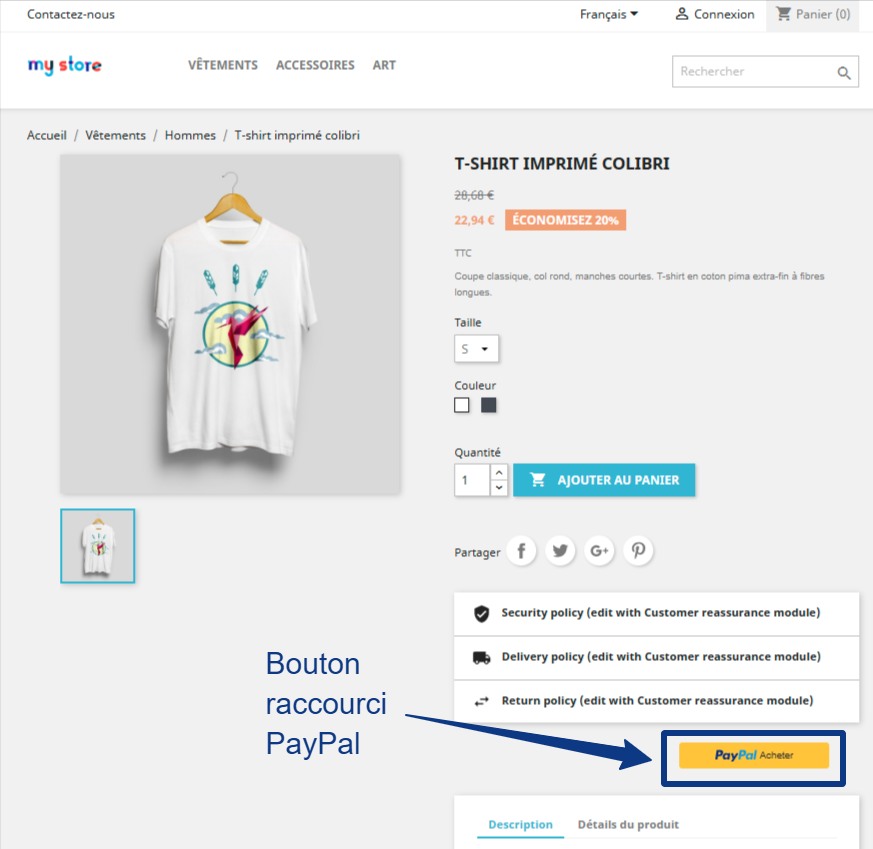
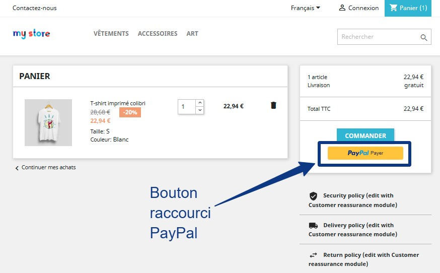
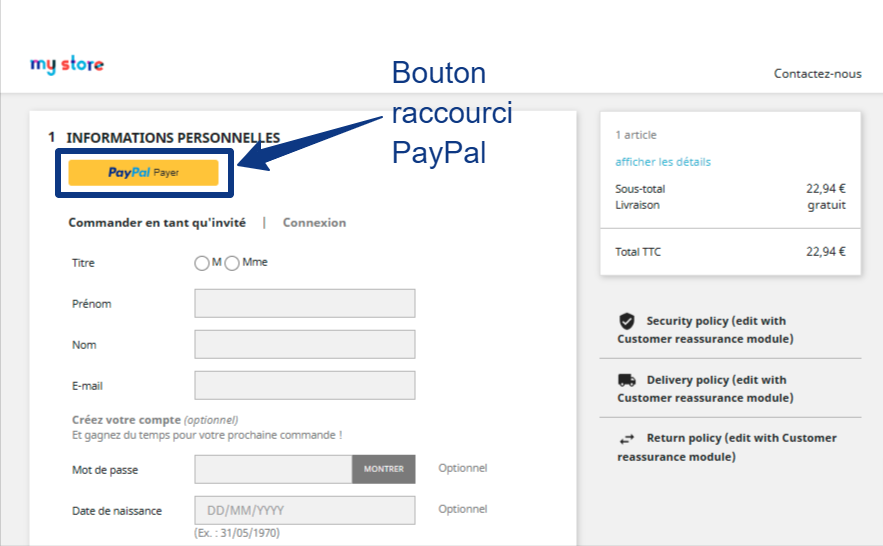
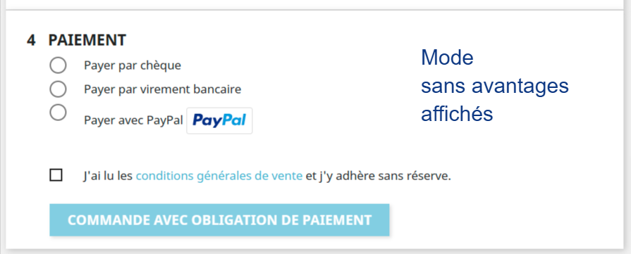
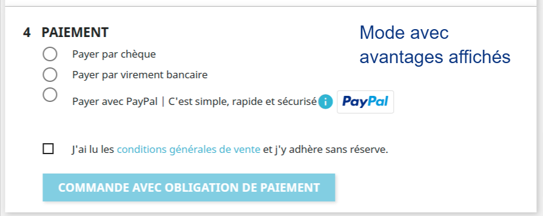
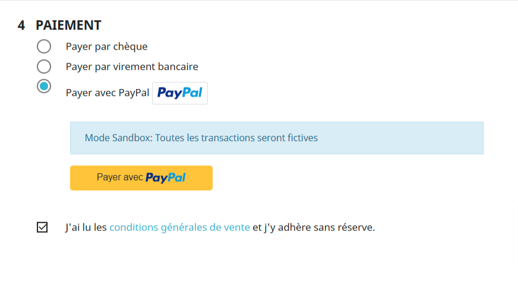
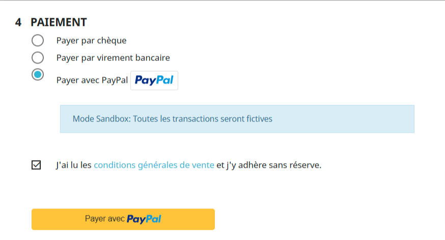

# Settings available in the Official PayPal module

## Payment collection mode

{ loading=lazy }

!!! note "Validity period of the authorization"
    With the ‘Authorize’ collection mode, capturing the payment is only possible for 29 days.

    Authorization and capture are subject to the following periods:

    - A validity period of 29 days that starts when the buyer authorizes the payment. During this period, the authorization places a hold on the buyer's balance to ensure that the payment amount is available for capture.

    - An honor period of 3 days, from the first to the third day of the authorization period. After most successful authorizations, PayPal honors 100% of the authorized funds during the honor period. A day starts at 12 a.m. PST and ends at 11:59 p.m. PST on the calendar day on which the authorization takes place.

## PayPal payment

{ loading=lazy }

There are two possible configurations for PayPal payments.

**The ‘In-context’ payment mode**

The ‘in-context’ payment mode opens the connection to the PayPal account in a pop-up window, allowing your buyers to complete their payment without leaving your website. It is a streamlined, modern and reassuring experience that benefits from the same security standards as a redirect to the PayPal site.

Note that **the conversion rate of the in-context mode is better.**

**The ‘Redirect’ payment mode**

The ‘Redirect’ payment mode sends the customer to the PayPal site, where they will be asked to sign in to their PayPal account. Once the transaction is complete, they will be brought back to your online store on the order confirmation page.

## ‘PayPal Express Checkout’ shortcuts

The display option for each location lets you decide whether or not to show the PayPal shortcut on:

- Product pages;

- The cart page;

- The sign-up step in the checkout.

You can also configure the style of the shortcut button in the ‘Customize the PayPal Shortcut’ section

### Default button rendering on a product page

{ loading=lazy }

### Default button rendering on the cart page

{ loading=lazy }

### Default button rendering at the sign-up step

{ loading=lazy }

If the customer is signed in and has a customer account on your PrestaShop store with the same email address as their PayPal account, they will be recognized as an existing customer and the shipping address from their PrestaShop account will be used for the order.

If the customer is not signed in and does not have a customer account on your PrestaShop store, a new customer record will be created on your PrestaShop store and the preferred shipping address from their PayPal account will be used.

## Brand name

The "brand name" is displayed at the top left during PayPal payment.

It is a label that replaces the company name from the PayPal account on the PayPal pages.

If you use PayPal Checkout, you can also customize your store logo. The logo can be changed via your business profile settings within your PayPal account.

## Presenting the benefits of PayPal to your customers

This option lets you display trust-building elements within your payment step.

**Rendering of the button displaying the PayPal benefits**

{ loading=lazy }

**Default button rendering at the sign-up step**

{ loading=lazy }

## Placing the PayPal button at the bottom of the checkout page

This setting lets you display the PayPal payment button at the bottom of the checkout page.

**Rendering of the payment button within the checkout page**

{ loading=lazy }

**Rendering of the payment button at the bottom of the checkout page**

{ loading=lazy }

## ‘Buy Now Pay Later’ button: offer installment payments with PayPal

Increase your conversion rate by allowing users to spread the payment for their purchase over time, paying in 3 or 4 installments.

As a merchant, you are paid immediately.

Enable the setting by activating the ‘Pay Later button’ feature

{ loading=lazy }

!!! note "Please note"
    As of 1 November 2024, the ‘Buy Now Pay Later\*’ option is available in the following countries: France, United Kingdom, United States, Germany, Austria, Australia, Spain, Italy, Canada.

    You can only promote the ‘Buy Now Pay Later\*’ feature if you are a merchant based in one of these countries and this country is selected as the “default country” in your PrestaShop store.

    The banners can only be displayed in the Front Office if the store currency matches one of these countries: EUR, USD, GBP, AUD;

***and** if the ISO code is one of the following: FR, EN, GB, DE, AT, AU, ES, IT, CA.*

*By default, the banners are enabled for all recommended pages. You can choose which page types promote ‘Buy Now Pay Later\*’ payment on your site.*

*The banners on your site will look similar to the banner below:*

### Conditions for displaying installment payments in the payment step of the checkout funnel

!!! note "Please note"
    PayPal must authorize installment payments in every case; this decision is made on a per-customer basis.

**Payment amount**

The minimum amount for installment payments varies depending on the country's currency.

Below are the minimum and maximum order amounts by country

| **Country** | **Product** | **Price** |
| --- | --- | --- |
| US | Pay in 4 | $30 to $1,500 |
| FR | Pay in 4 | €30 to €2,000 |
| UK | Pay in 3 | £30 to £2,000 |
| DE | Pay in 12 | €99 to €5,000 |
| AU | Pay in 4 | 1 – 1,999.99 AUD |
| ES | Pay in 3x, Pay in 6,12,24 | 30 – 2,000 Euro |
| IT | Pay in 3x, Pay in 6,12,24 | 30 – 2,000 Euro |

## ‘Buy Now Pay Later’ messages: promote installment payments

Promote installment payments within your site and increase your conversion rate and customer satisfaction.

{ loading=lazy }

**The best way to choose?**

A visual preview guides you during configuration in your PrestaShop Back Office so that you can quickly choose the best option for your online store.

Once you have made your decision and applied your settings, test the displays live on your site [using IP restriction](#switching-to-ip-restriction-mode) and take the time to make your choices before showing the finalized new features to your customers.

## Customize the ‘PayPal Express Checkout’ shortcuts

Adapt the PayPal payment shortcuts to your brand guidelines quickly and effectively.

{ loading=lazy }

You have many customization options: color, shape, size and button type.

As you change the settings, you can see the rendering of your PayPal logo live on the Back Office page.

!!! note "Please note"
    People around the world recognize PayPal by its gold color, and studies confirm it. Extensive testing has determined the right shade and the right shape that help **increase conversion**. Use it on your website to take advantage of PayPal's recognition and preference.

    If gold does not work for your site, try the PayPal blue button. Studies show that people know it is the PayPal brand color, which brings a halo of trust and security to your experience.

    If gold or blue does not suit the design or aesthetics of your site, try the silver, white or black buttons. As these colors are less likely to attract people's attention, we recommend these button colors as a last alternative.

## Customize your order statuses

By default, the following statuses will trigger the following actions:

- An order moved to the ‘Refunded’ status will trigger the refund on PayPal;

An order moved to the ‘Canceled’ status will trigger the cancellation on PayPal.

By default, orders placed with the PayPal module have the following statuses:

- ‘Payment accepted’ for an order whose payment is validated by PayPal;
- ‘Awaiting PayPal payment’ for a payment that has been captured and is awaiting validation via the webhook;

You can refund orders paid via PayPal directly from your PrestaShop Back Office. With this setting, you can choose the order status that triggers the refund on PayPal. Choose the ‘No action’ option if you want to change the order status without triggering the automatic refund on PayPal.

You can cancel orders paid via PayPal directly from your PrestaShop Back Office. With this setting, you can choose the order status that triggers PayPal's cancellation of an authorized transaction on PayPal. Choose the ‘No action’ option if you want to change the order status without triggering the automatic cancellation on PayPal.

If you use the [‘Authorize’ collection mode](#payment-collection-mode), this means that you separate the payment authorization from the payment capture. To capture the authorized payment, you must change the order status to “payment accepted” (or to a custom status with the same meaning). With this setting, you can choose a custom order status to accept the order and validate transactions in ‘Authorize’ mode.

## Switching to IP restriction mode

With this feature, you can test payment in sandbox mode and test all of your settings on your online store BEFORE making PayPal payment available to all of your customers.

How it works:

- find your IP address by going to a public service such as Nord VPN or any other available service <https://nordvpn.com/what-is-my-ip/>
- copy the retrieved IP address into the ‘List of allowed IPs’ field
- click ‘Save’

!!! danger "Warning"
    if your PayPal module is already accessible on your live site, adding an IP restriction will make your PayPal module invisible to all of your users except those with the allowed IP address or addresses.

## Configuring tracking settings

Benefit from the best seller protection by configuring tracking on your PrestaShop store.

By selecting the order status from which the order is handled by the carrier, PayPal considers that your side of the contract binding you to your customer has been fulfilled and offers you better protection in the event of a dispute.

The list of carriers offered depends on your country.

If none of the carriers offered in the PayPal list matches your carrier, choose ‘OTHER’.
