# Configurations disponibles dans le module PayPal Officiel

## Mode de prélèvement

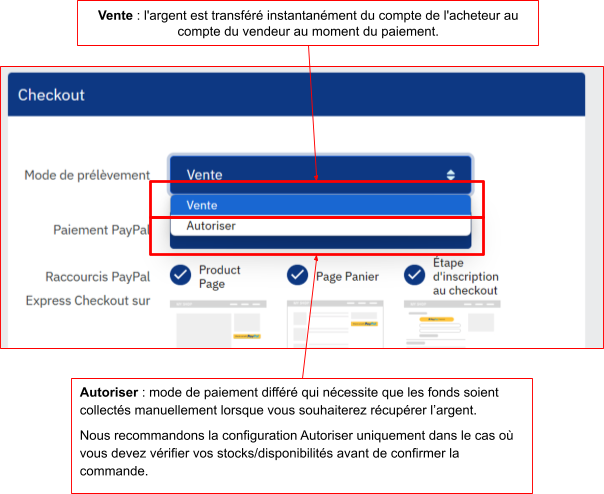{ loading=lazy }

!!! note "Délai de validité de la période d’autorisation"
    La capture du paiement dans le cas du mode de prélèvement ‘Autoriser’ n’est possible que pendant 29 jours.

    L'autorisation et la saisie s'entendent sur les périodes suivantes :

    - Une période de validité de 29 jours qui commence lorsque l'acheteur autorise le paiement. Pendant cette période, l'autorisation met le solde de l'acheteur en attente afin de s'assurer que le montant du paiement est disponible pour la capture.

    - Une période d'honneur de 3 jours, du premier au troisième jour de la période d'autorisation. Après la plupart des autorisations réussies, PayPal honore 100 % des fonds autorisés pendant la période d'honneur. Un jour commence à 12 heures PST et se termine à 23h59 PST le jour calendaire où l'autorisation a lieu.

## Paiement PayPal

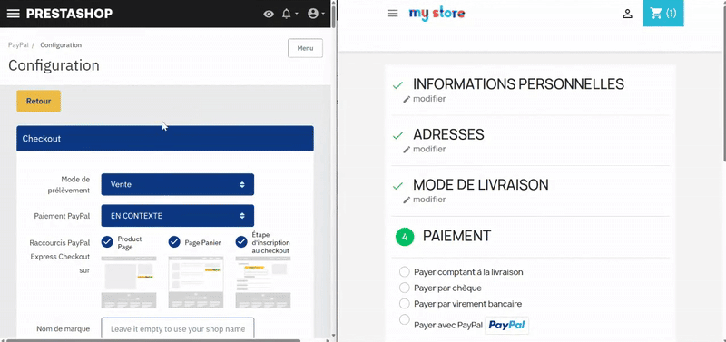{ loading=lazy }

Il existe deux configurations possibles pour les paiements PayPal.

**Le mode de paiement ‘En contexte’**

Le mode de paiement ‘en contexte’ ouvre la connexion au compte PayPal dans une fenêtre pop-up, permettant à vos acheteurs de finaliser leur paiement sans quitter votre site Web. Il s’agit d’une expérience optimisée, moderne et rassurante qui bénéficie des mêmes standards de sécurité que lors d'une redirection vers le site PayPal.

A noter que **le taux de conversion du mode en contexte est meilleur.**

**Le mode de paiement ‘Rediriger’**

Le mode de paiement ‘Rediriger’ redirige le client vers le site PayPal, où il lui sera demandé de se connecter à son compte PayPal. Après finalisation de la transaction, il sera ramené vers votre boutique en ligne sur la page de confirmation de commande.

## Raccourcis ‘PayPal Express Checkout’

L’option d’affichage sur chaque emplacement permet de décider d’afficher ou non le raccourci PayPal sur :

- Les pages produits ;

- La page panier ;

- L’étape d’inscription dans le checkout.

Vous avez également la possibilité de configurer le style du bouton de raccourci dans la partie ‘Personnaliser le Shortcut PayPal’

### Rendu du bouton par défaut sur une page produit

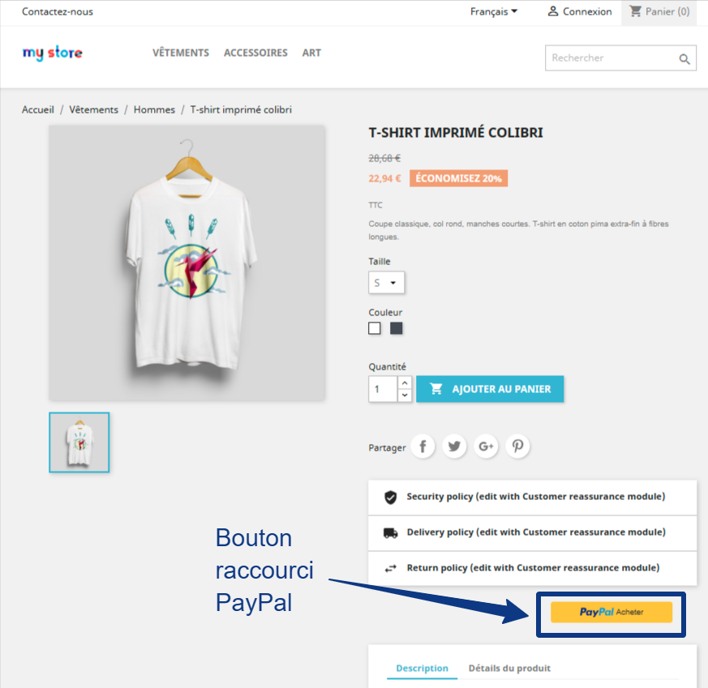{ loading=lazy }

### Rendu du bouton par défaut sur la page panier

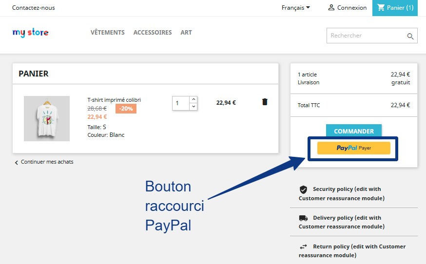{ loading=lazy }

### Rendu du bouton par défaut sur l’étape d’inscription

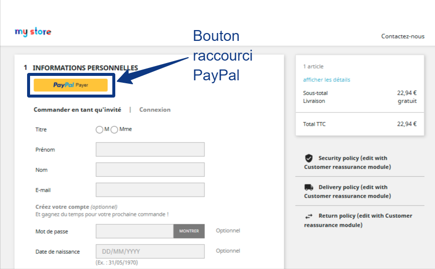{ loading=lazy }

Si le client est connecté et a un compte client sur votre boutique PrestaShop avec le même email que son compte PayPal, il sera reconnu comme un client existant et l'adresse de livraison de son compte PrestaShop sera utilisée pour la commande.

Si le client n’est pas connecté et n'a pas de compte client sur votre boutique PrestaShop, une nouvelle entrée client sera créée sur votre boutique PrestaShop et l'adresse de livraison préférée de son compte PayPal sera utilisée.

## Nom de marque

Le "nom de marque" est affiché en haut à gauche lors du paiement PayPal.

Il s'agit d'une étiquette qui remplace le nom de l'entreprise dans le compte PayPal sur les pages PayPal.

Si vous utilisez PayPal Checkout, vous pouvez également personnaliser le logo de votre boutique. Le logo peut être modifié via les paramètres de votre profil d'entreprise au sein de votre compte PayPal.

## Présenter les avantages PayPal à vos clients

Cette option vous permet d’afficher des éléments de réassurance au sein de votre étape de paiement.

**Rendu du bouton affichant les avantages PayPal**

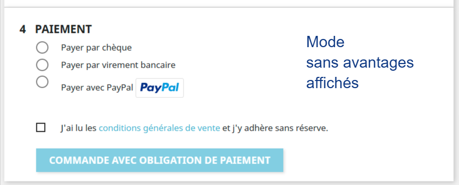{ loading=lazy }

**Rendu du bouton par défaut sur l’étape d’inscription**

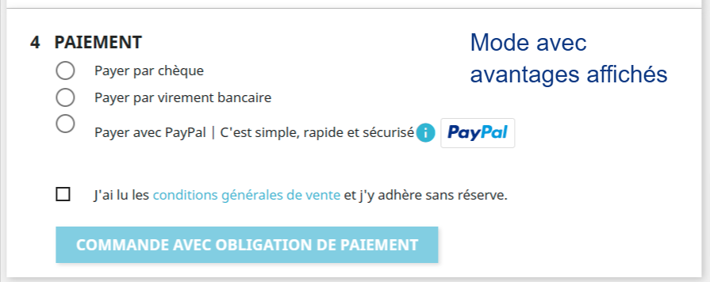{ loading=lazy }

## Mettre le bouton PayPal à la fin de la page de commande

Cette configuration vous permet d’afficher le bouton de paiement PayPal à la fin de la page de commande.

**Rendu du bouton de paiement dans la page de commande**

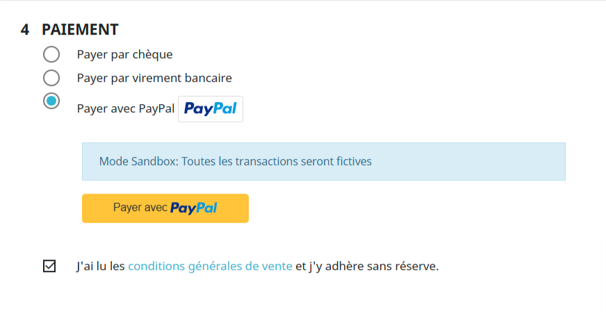{ loading=lazy }

**Rendu du bouton de paiement à la fin de la page de commande**

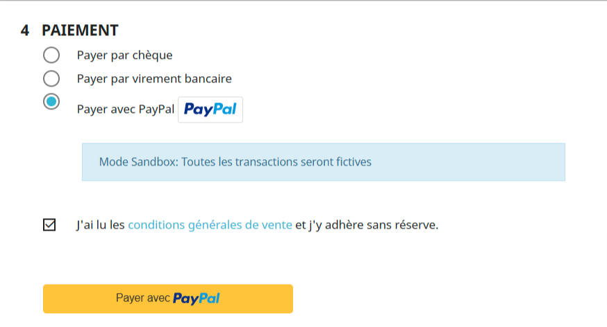{ loading=lazy }

## Bouton ‘Buy Now Pay Later’ : proposez le paiement en plusieurs fois avec PayPal

Augmentez votre taux de conversion en permettant à l’utilisateur de lisser le paiement de son achat dans le temps, en payant en 3 ou 4 fois.

En tant que marchand, vous êtes payé immédiatement.

Activez la configuration en activant la fonctionnalité ‘Bouton Pay Later’

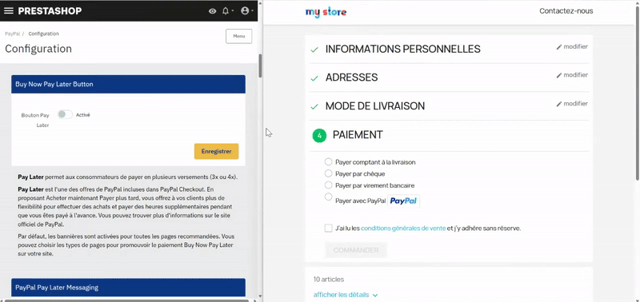{ loading=lazy }

!!! note "A noter"
    Au 1er novembre 2024, l'option de 'Buy Now Pay Later\*' est disponible pour les pays suivants : France, Royaume-Uni, Etats-Unis, Allemagne, Autriche, Australie, Espagne, Italie, Canada.

    Vous ne pouvez promouvoir la fonctionnalité ‘Buy Now Pay Later\*’ que si vous êtes un marchand basé dans l'un de ces pays et que ce pays est sélectionné comme “pays par défaut” dans votre boutique PrestaShop.

    Les bannières ne peuvent être affichées dans le Front Office que si la devise de la boutique correspond à l'un de ces pays :EUR, USD, GBP, AUD ;

***et** si le code ISO est l'un des suivants :FR, EN, GB, DE, AT, AU, ES, IT, CA.*

*Par défaut, les bannières sont activées pour toutes les pages recommandées. Vous pouvez choisir les types de pages pour promouvoir le paiement ‘Buy Now Pay Later\*’ sur votre site.*

*Les bannières sur votre site seront semblables à la bannière ci-dessous :*

### Conditions d’affichage du paiement en plusieurs fois dans la partie paiement du tunnel de commande

!!! note "A noter"
    PayPal doit systématiquement autoriser le paiement en plusieurs fois, ce choix est effectué en fonction du client.

**Montant du paiement**

Le montant minimum du paiement en plusieurs fois varie en fonction de la devise du pays.

Ci-dessous les montants de commande minimum et maximum en fonction des pays

| **Pays** | **Produit** | **Prix** |
| --- | --- | --- |
| US | Payer en 4 X | De $30 à $1500 |
| FR | Payer en 4 X | De 30€ à 2000€ |
| UK | Payer en 3 X | De 30£ à 2000£ |
| DE | Payer en 12 X | De 99€ à 5000€ |
| AU | Pay in 4 | 1 – 1,999.99 AUD |
| ES | Pay in 3x, Pay in 6,12,24 | 30 – 2,000 Euro |
| IT | Pay in 3x, Pay in 6,12,24 | 30 – 2,000 Euro |

## Messages ‘Buy Now Pay Later’ : Faites la promotion du paiement en plusieurs fois

Faites la promotion du paiement en plusieurs fois au sein de votre site et augmentez votre taux de conversion et la satisfaction de vos clients.

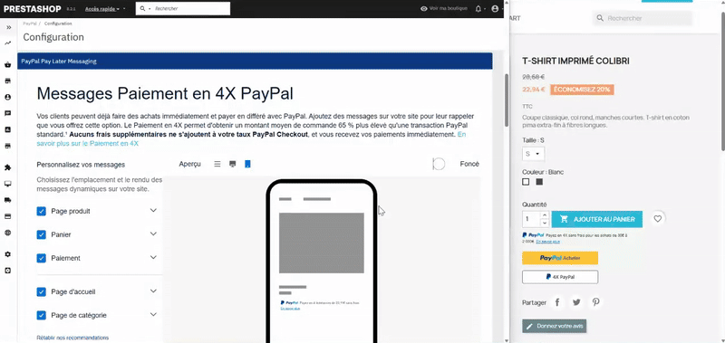{ loading=lazy }

**La meilleure manière de choisir ?**

Un rendu visuel vous accompagne lors de la configuration dans votre Back Office PrestaShop afin que vous puissiez choisir rapidement la meilleure option pour votre boutique en ligne.

Une fois votre décision prise et vos configurations effectuées, testez les affichages en live sur votre site [grâce à la restriction IP](#passer-en-mode-restriction-ip) et prenez le temps de faire vos choix avant d’afficher les nouvelles fonctionnalités finalisées à vos clients.

## Personnalisez les raccourcis ‘PayPal Express Checkout’

Adaptez les raccourcis de paiement PayPal à votre charte graphique de manière rapide et efficace.

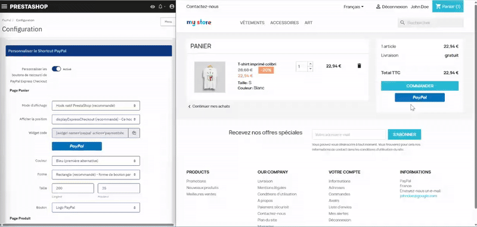{ loading=lazy }

Vous avez de nombreuses possibilités de personnalisation : couleur, forme, taille, type de bouton.

En modifiant la configuration, vous pouvez voir en direct sur la page de Back Office le rendu de votre logo PayPal suite à vos modifications.

!!! note "A noter"
    Les gens du monde entier reconnaissent PayPal pour la couleur or et les études le confirment. Des tests approfondis ont permis de déterminer la bonne nuance et la bonne forme qui contribuent à **augmenter la conversion**. Utilisez-le sur votre site web pour tirer parti de la reconnaissance et de la préférence de PayPal.

    Si l'or ne fonctionne pas pour votre site, essayez le bouton bleu de PayPal. Les études montrent que les gens savent que c'est la couleur de la marque PayPal, ce qui donne un halo de confiance et de sécurité à votre expérience.

    Si le doré ou le bleu ne convient pas à la conception ou à l'esthétique de votre site, essayez les boutons argentés, blancs ou noirs. Ces couleurs étant moins à même d'attirer l'attention des gens, nous recommandons ces couleurs de boutons comme dernière alternative.

## Personnalisez le statut de vos commandes

Par défaut, les statuts suivants vont déclencher les actions suivantes :

- Une commande passée au statut ‘Remboursé’ va déclencher le remboursement sur PayPal ;

Une commande passée au statut ‘Annulé’ va déclencher l’annulation sur PayPal.

Par défaut, les commandes passées avec le module PayPal ont les statuts suivants :

- ‘Paiement accepté’ dans le cas d’une commande dont le paiement est validé par PayPal ;
- ‘En attente de paiement PayPal’ dans le cas d’un paiement capturé et en attente de validation via le webhook ;

Vous pouvez rembourser les commandes payées via PayPal directement via votre Back Office PrestaShop. Grâce à cette configuration, vous pouvez choisir le statut de la commande qui déclenche le remboursement sur PayPal. Choisissez l'option 'Aucune action' si vous souhaitez modifier le statut de la commande sans déclencher le remboursement automatique sur PayPal.

Vous pouvez annuler les commandes payées via PayPal directement via votre Back Office PrestaShop. Grâce à cette configuration, vous pouvez choisir le statut de la commande qui déclenche l'annulation par PayPal d'une transaction autorisée sur PayPal. Choisissez l'option 'Aucune action' si vous souhaitez modifier le statut de la commande sans déclencher l'annulation automatique sur PayPal.

Si vous utilisez le [mode de prélèvement ‘Autoriser’](#mode-de-prelevement), cela signifie que vous séparez l'autorisation de paiement de la capture du paiement. Pour capturer le paiement autorisé, vous devez changer le statut de la commande en « paiement accepté » (ou en un statut personnalisé avec la même signification). Grâce à cette configuration, vous pouvez choisir un statut de commande personnalisé pour accepter la commande et valider les transactions en mode ‘Autoriser’.

## Passer en mode restriction IP

Grâce à cette fonctionnalité, vous pouvez tester le paiement en mode sandbox et tester l’ensemble de vos configurations sur votre boutique en ligne AVANT de mettre le paiement PayPal disponible à l’ensemble de vos clients.

Fonctionnement :

- trouver votre adresse IP en vous rendant sur un service public de type Nord VPN ou tout autre service disponible <https://nordvpn.com/what-is-my-ip/>
- copier l’adresse IP récupérée dans le champ ‘Liste des IPs autorisées’
- cliquer sur ‘Enregistrer’

!!! danger "Attention"
    si votre module PayPal est déjà accessible sur votre site en production, ajouter une restriction IP rendra votre module PayPal invisible pour l’ensemble de vos utilisateurs sauf aux personnes ayant l’adresse ou les adresses IP s autorisées.

## Configurer les paramètres de suivi

Bénéficiez de la meilleure protection marchand grâce à la configuration du tracking sur votre PrestaShop.

En sélectionnant le statut de la commande à partir duquel la commande est traitée par le transporteur, PayPal considère que votre partie du contrat vous liant à votre client a été remplie et vous offre une meilleure protection en cas de litige.

La liste des transporteurs proposée dépend de votre pays.

Si aucun transporteur proposé par la liste PayPal ne correspond à votre transporteur, choisissez ‘OTHER’.
