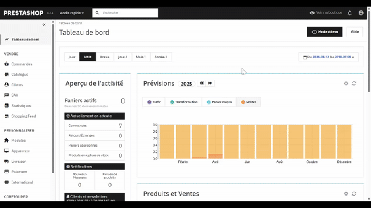
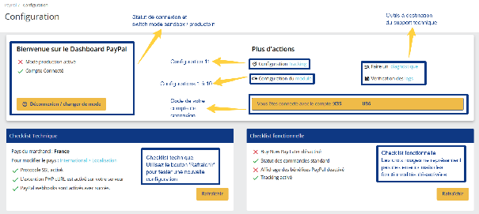

# Installation et prise en main

Télécharger, installer et découvrir la page de configuration du module PayPal Officiel.

# Installation du module PayPal Officiel

Téléchargez le module PayPal Officiel sur la market place PrestaShop AddOns :
[https://addons.prestashop.com/fr/paiement-carte-wallet/1748-paypal-officiel.html](https://addons.prestashop.com/fr/paiement-carte-wallet/1748-paypal-officiel.html)
Puis installez le zip sur votre boutique PrestaShop

# Naviguer dans votre page de configuration

