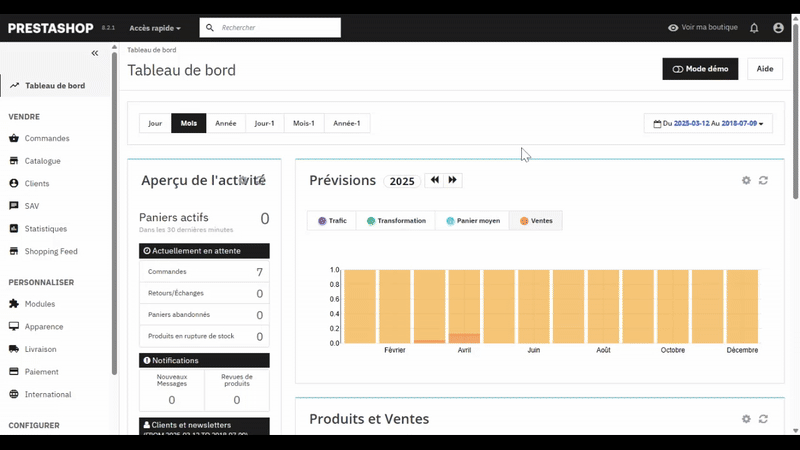

# Installation du module PayPal Officiel

Téléchargez le module PayPal Officiel sur la market place PrestaShop AddOns :

<https://addons.prestashop.com/fr/paiement-carte-wallet/1748-paypal-officiel.html>

Puis installez le zip sur votre boutique PrestaShop

{ loading=lazy }
