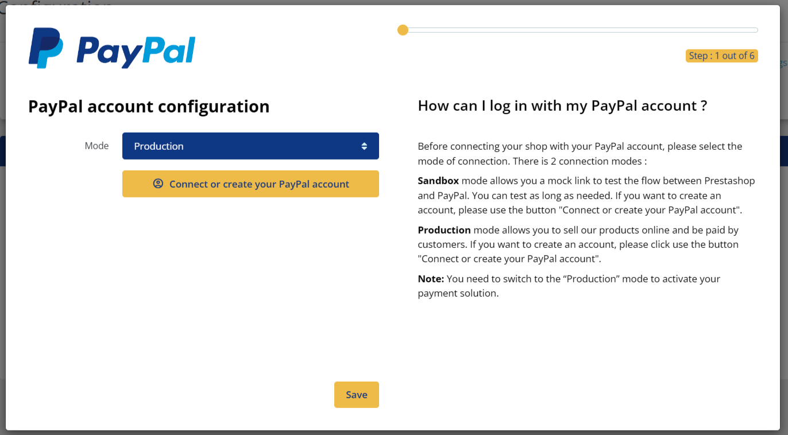
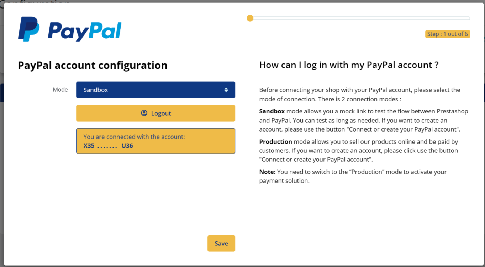
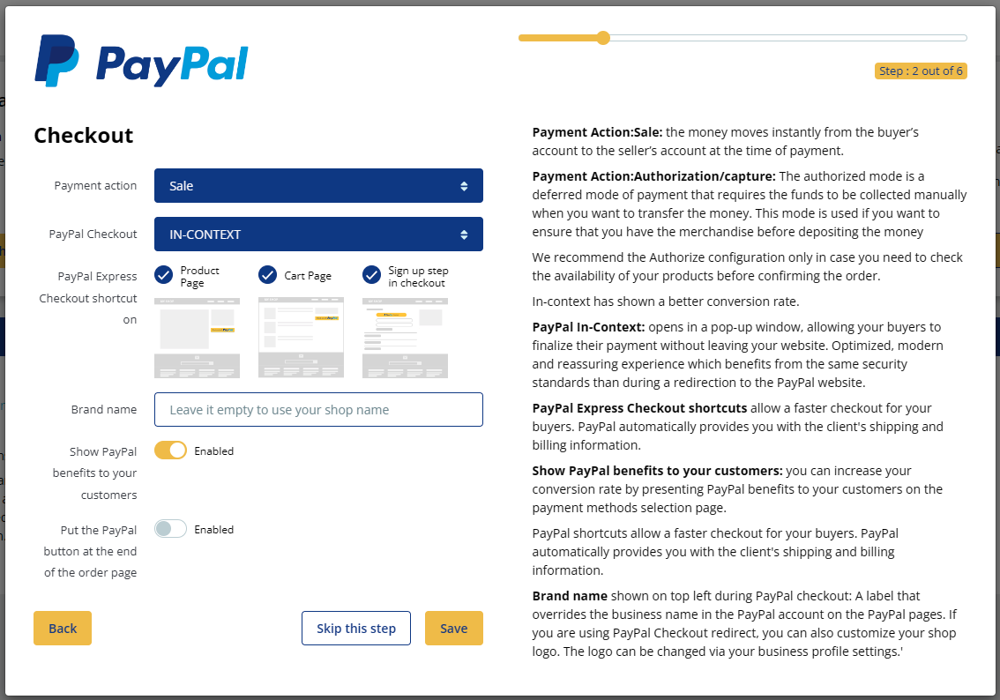
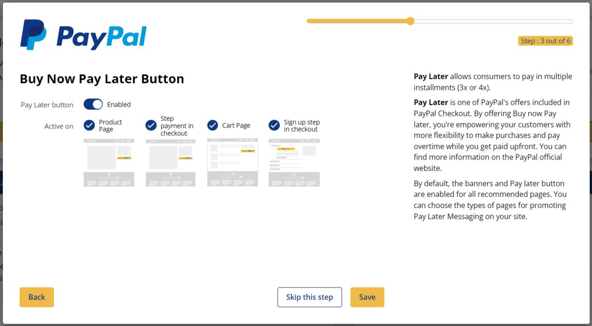
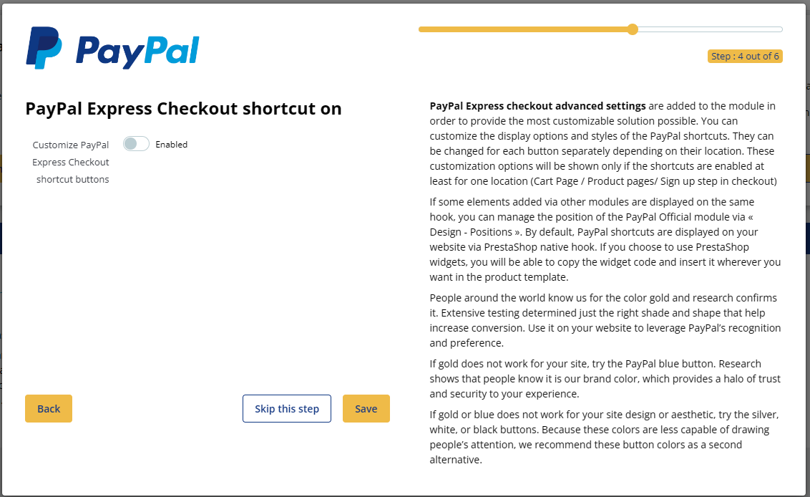
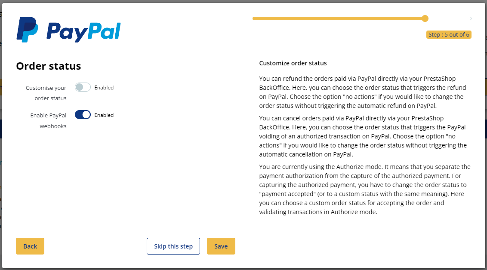
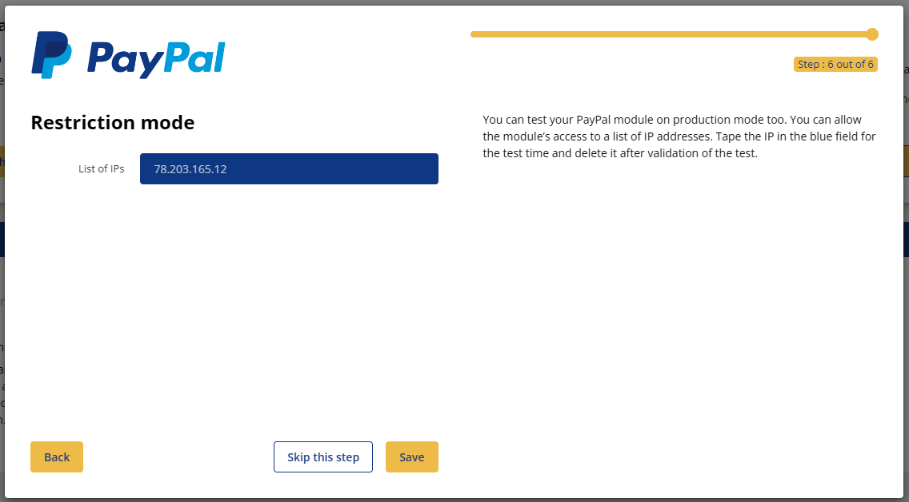

# Onboarding for the Official PayPal module

During the **first installation** of the Official PayPal module on PrestaShop, a quick setup via an onboarding flow is offered, allowing you to select the best settings for your business.

## First connection, step 1: signing in to or creating a PayPal Business account

During this step, you must select ‘Production’ mode or ‘Sandbox’ mode, then click the button to sign in to or create a PayPal Business account. Initially, it can be useful to configure ‘Sandbox’ mode to test the flow between PrestaShop and PayPal. Please note that you will need to switch to ‘Production’ mode to activate your payment solution.

A pop-in will open, allowing you to create or sign in to your PayPal Business account.

{ loading=lazy }

After signing in to your PayPal Business account, the window will refresh and display the code of your connected account.

Save the configuration to move on to the next step.

{ loading=lazy }

## First connection, step 2: configuring the checkout of your online store

From this step onwards, you can start making your configuration choices for your Official PayPal module.

To help you, the settings that perform best for your business have been pre-selected for you.

Do not worry about these first choices: each of these settings can be changed later in the standard configuration page of the module.

in the right-hand part of your module, you can read contextual explanations for each of the options offered to you.

Each of these settings and its impact is detailed earlier in our documentation:

- [Payment collection mode](configuration.en.md#payment-collection-mode)
- [PayPal payment](configuration.en.md#paypal-payment)
- [‘PayPal Express Checkout’ shortcuts](configuration.en.md#paypal-express-checkout-shortcuts)
- [Brand name](configuration.en.md#brand-name)
- [Presenting the benefits of PayPal to your customers](configuration.en.md#presenting-the-benefits-of-paypal-to-your-customers)
- [Placing the PayPal button at the bottom of the checkout page](configuration.en.md#placing-the-paypal-button-at-the-bottom-of-the-checkout-page)
- [‘Buy Now Pay Later\*’ button](configuration.en.md#buy-now-pay-later-button-offer-installment-payments-with-paypal)
- [‘Buy Now Pay Later\*’ messages](configuration.en.md#buy-now-pay-later-messages-promote-installment-payments)
- [Customize your order statuses](configuration.en.md#customize-your-order-statuses)
- [Switching to IP restriction mode](configuration.en.md#switching-to-ip-restriction-mode)

{ loading=lazy }

## First connection, step 3: configuring installment payments

This step is about configuring your preferences for the display of the installment payment button. Installment payments allow your customers to pay for their products in several installments.

This type of commercial offer to your customers increases the conversion rate of your online store.

{ loading=lazy }

## First connection, step 4: customizing the PayPal shortcut buttons

This step involves customizing the PayPal shortcut buttons.

{ loading=lazy }

## First connection, step 5: configuring order statuses and webhooks

This step involves customizing the PayPal shortcut buttons.

{ loading=lazy }

## First connection, step 6: IP restriction

This step involves deciding on which IP address you want the PayPal buttons to be displayed. This way, during your configuration phase in Sandbox mode, no customer will see the PayPal buttons on your online store.

{ loading=lazy }
