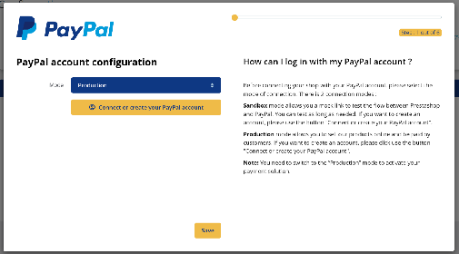
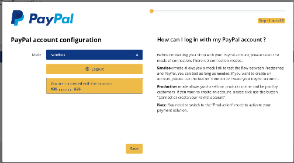
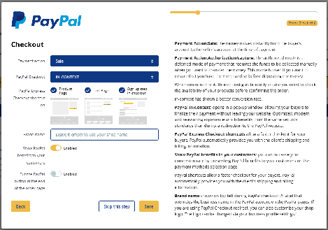
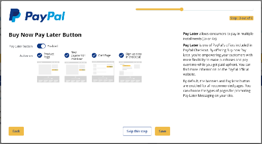
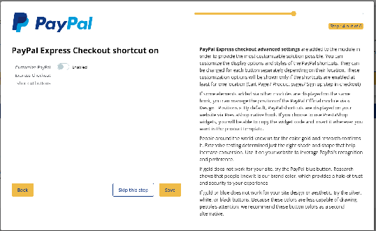
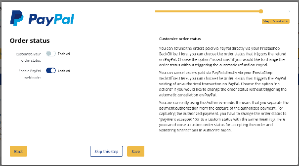
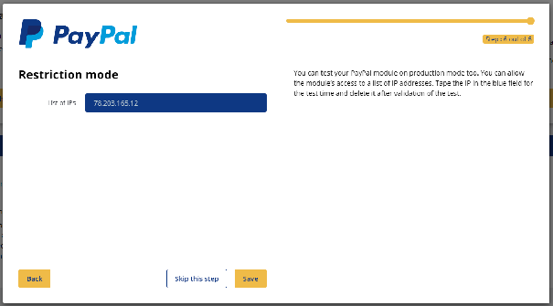

# Onboarding : la première configuration

# On Boarding du module PayPal Officiel

Lors de la **1ère installation** du module PayPal Officiel sur Prestashop, une configuration rapide via un On Boarding vous est proposée, qui vous permet de sélectionner les meilleures configurations pour votre business.

## Première connexion étape 1 : Connexion ou création de compte PayPal Professionnel

Lors de cette étape, vous devez sélectionner le mode ‘Production’ ou le mode ‘Sandbox’, puis cliquer sur le bouton de connexion ou de création d’un compte PayPal pour les Professionnels. Dans un 1er temps, il peut être utile de configurer le mode ‘Sandbox’ pour tester le flux entre PrestaShop et PayPal. Attention, vous devrez passer en mode ‘Production’ pour activer votre solution de paiement.
Une pop-in va s’ouvrir qui va vous permettre de vous créer ou de vous connecter à votre compte PayPal pour les Professionnels.

Après vous être connecté à votre compte PayPal pour les Professionnels, la fenêtre va s’actualiser en indiquant le code de votre compte de connexion.
Sauvegardez la configuration pour passer à l’étape suivante.

## Première connexion étape 2 : Configuration du checkout de votre boutique en ligne

A partir de cette étape, vous allez pouvoir démarrer vos choix de configurations de votre module PayPal Officiel.
Afin de vous aider, les configurations les plus porteuses pour votre business ont été pré-sélectionnées pour vous.

Pas d’inquiétude lors de ces premiers choix, chacune de ces configurations pourra être modifiée ultérieurement dans la page de configuration classique du module.
dans la partie droite de votre module, vous pouvez prendre connaissance d’explications contextuelles pour chacune des options qui vous est proposée.

Chacune de ces configurations et ses impacts est détaillé en amont dans notre documentation :

- [Mode de prélèvement](configuration.md#mode-de-prelevement)
- [Paiement PayPal](configuration.md#paiement-paypal)
- [Raccourcis ‘PayPal Express Checkout’](configuration.md#raccourcis-express-checkout)
- [Nom de marque](configuration.md#nom-de-marque)
- [Présenter les avantages PayPal à vos clients](configuration.md#avantages-paypal)
- [Mettre le bouton PayPal à la fin de la page de commande](configuration.md#bouton-fin-de-page)
- [Bouton ‘Buy Now Pay Later*’](configuration.md#bouton-pay-later)
- [Messages ‘Buy Now Pay Later*’](configuration.md#messages-pay-later)
- [Personnalisez le statut de vos commandes](configuration.md#statuts-commandes)
- [Passer en mode restriction IP](configuration.md#restriction-ip)

## Première connexion étape 3 : Configuration du paiement en plusieurs fois

Il s’agit ici de configurer vos préférences pour les affichages du bouton de paiement en plusieurs fois. Le paiement en plusieurs fois permet à vos clients de payer leurs produits en plusieurs échéances.
Ce type de proposition commerciale à vos clients augmente le taux de conversion de votre boutique en ligne.

## Première connexion étape 4 : Personnalisation des boutons de raccourci PayPal

Il s’agit lors de cette étape de personnaliser les boutons de raccourci PayPal.

## Première connexion étape 5 : Configuration des statuts de commande et des webhooks

Il s’agit lors de cette étape de personnaliser les boutons de raccourci PayPal.

## Première connexion étape 6 : Restriction IP

Il s’agit lors de cette étape de décider sur quelle IP vous souhaitez que les boutons PayPal s’affichent. De cette manière, durant votre phase de configuration en mode Sandbox, aucun client ne verra les boutons PayPal sur votre boutique en ligne.

