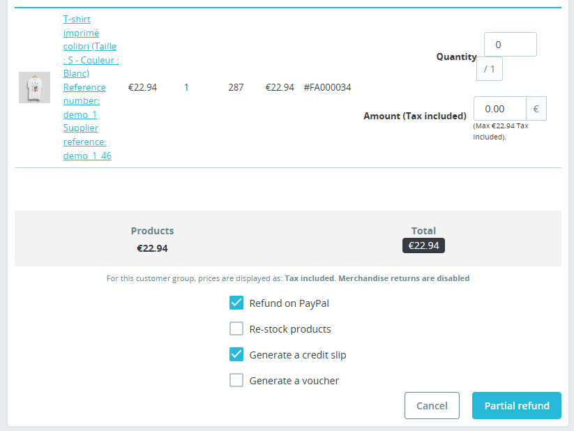

# Refunding a transaction

After an order has been placed, you can refund all or part of the order from the native PrestaShop refund screen.

The refund will be sent directly to PayPal and your customer will be refunded.

{ loading=lazy }
