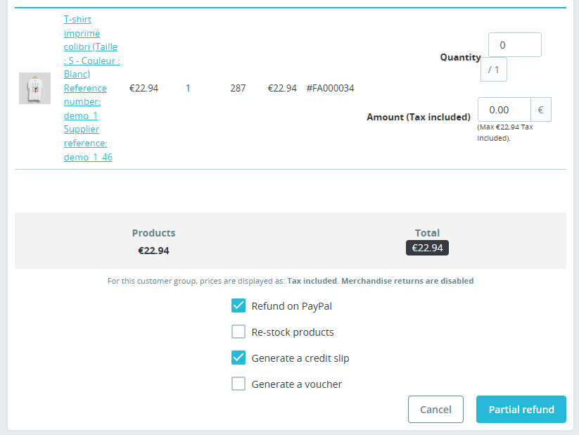

# Remboursement d’une transaction

Après passage d’une commande, vous avez la possibilité depuis l’écran de remboursement natif de PrestaShop de rembourser tout ou partie de la commande.

Le remboursement sera directement envoyé à Paypal et votre client remboursé.

{ loading=lazy }
